# 👋🏼 Introduction
**How does gender influence the roles and responsibilities of household heads and members in the Philippines?**
In what ways does gender shape family dynamics within households?
To what extent do gender roles impact access to education, employment opportunities, and financial literacy?

These questions popped into my head after reading *‘Invisible Women: Exposing Data Bias in a World Designed for Men’* by Caroline Criado Perez. The book discussed **the gender data gap,** and highlighted multiple examples of gender bias mainly in Europe and America. As a Filipino, I wondered how similar or different things were for my country. 🤔

I worked with a public dataset available on the website of the Philippine Statistics Authority: Annual Poverty Indicators Survey 2019.* I figured that analyzing this sex-disaggregated data would help me uncover valuable insights into families in the Philippines and the presence and impact of gender roles. Using SQL and Tableau, I analyzed relationships between certain variables and visualized my results. 📊

This is the second part of my project. The first part was shared on Tableau Public and can be viewed [here](https://public.tableau.com/views/GenderRolesinthePhilippines2019/HeadofHousehold1?:language=en-US&:sid=&:redirect=auth&:display_count=n&:origin=viz_share_link).

**I decided to use the 2019 dataset as this was the latest one available on the website that was the most complete. I hope to keep updating this project as new data becomes available.*

# 🗂️ Background
The Annual Poverty Indicators Survey by the PSA is a survey which gathers data on the socio-economic profile of families in the Philippines. You can check out the dataset I used [here](https://psada.psa.gov.ph/catalog/246/study-description).

Specifically, I used the files Household, Person Record, and Social Protection (PhilHealth, Child Protection, Disasters Preparedness Kit). These files contain demographic and economic characteristics of the family head and family members, and information on social protection programs.

Additionally, the data came with a dictionary which defined the variables used per file. You can check it out [here](apis_2019_metadata_dictionary.xlsx). 

This project is limited to the data available in the given dataset and files used, and does not include any other data taken from elsewhere.

# 🧰 Tools I Used
For this project, I used these key tools:
- SQL: This allowed me to query the database and retrieve the essential data I needed to gain insights.
- PostgreSQL: This was the most ideal database management system for me to use.
- Visual Studio Code: This made executing SQL queries more convenient and efficient.
- Tableau: This allowed me to create simple yet effective visuals that captured the results of my code.
- Git & Github: These allowed me to share my SQL scripts and analysis, and made sure versions were kept up to date.

# 📉 The Analysis
## 1. Employment Status of Head

I wanted to know the distribution of employed and unemployed male and female heads across (1) age group, and (2) civil status.

```sql
WITH employment_table AS (
    SELECT
        hhid,
        h04_sex,
        h06_status,
        h13_did_work,
        h05_age,
        CASE
            WHEN h05_age <=17 THEN '13 to 17'
            WHEN h05_age <=29 THEN '18 to 29'
            WHEN h05_age <=39 THEN '30 to 39'
            WHEN h05_age <=49 THEN '40 to 49'
            WHEN h05_age <=59 THEN '50 to 59'
            WHEN h05_age <=69 THEN '60 to 69'
            WHEN h05_age <=79 THEN '70 to 79'
            WHEN h05_age <=89 THEN '80 to 89'
            ELSE '90 to 99'
        END AS age_group
    FROM
        household_data
    ORDER BY
        h04_sex,
        h06_status
)

SELECT
    age_group,
    h13_did_work,
    COUNT(age_group)
FROM
    employment_table
WHERE
    h04_sex = 1
GROUP BY
    age_group,
    h13_did_work
ORDER BY
    age_group,
    h13_did_work;
```

*I ran the code above twice, changing the WHERE clause from 1 to 2, to see male vs female data. I did this for all future code blocks as well.*

These were the results:
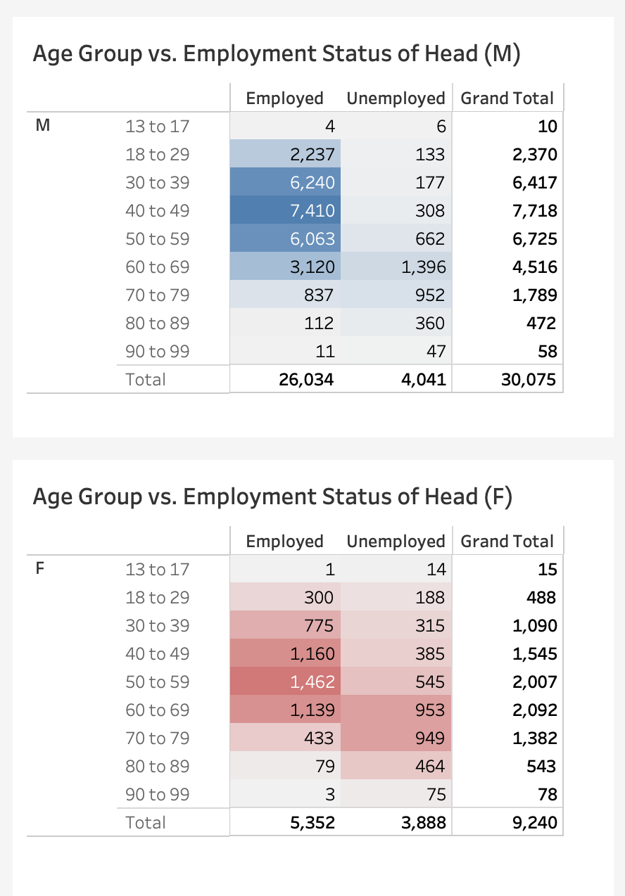
A greater percentage of male heads are employed compared to female heads, particularly those of ages 30 to 59. For female heads, the more employed ages are 40 to 69.

```sql
SELECT
    h06_status,
    h13_did_work,
    COUNT(h13_did_work)
FROM
    household_data
WHERE
    h04_sex = 2
GROUP BY
    h13_did_work,
    h06_status
ORDER BY
    h06_status;
```
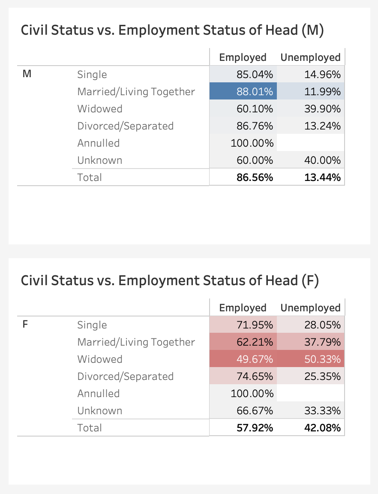

While 88.01% of male married heads are employed, only 62.21% of married female heads are employed. It's also something to note that widowed female heads are quite evenly distributed, with 49.67% employed and 50.33% unemployed.

## 2. Work Class of Head

The next relationship I wanted to explore was the work class of heads and their age group and civil status.

```sql
WITH workclass_table AS (
    SELECT
        hhid,
        h04_sex,
        h14_cls_wkr,
        h06_status,
        CASE
            WHEN h05_age <=17 THEN '13 to 17'
            WHEN h05_age <=29 THEN '18 to 29'
            WHEN h05_age <=39 THEN '30 to 39'
            WHEN h05_age <=49 THEN '40 to 49'
            WHEN h05_age <=59 THEN '50 to 59'
            WHEN h05_age <=69 THEN '60 to 69'
            WHEN h05_age <=79 THEN '70 to 79'
            WHEN h05_age <=89 THEN '80 to 89'
            ELSE '90 to 99'
        END AS age_group
    FROM
        household_data
    ORDER BY
        h04_sex,
        h14_cls_wkr
)

SELECT
    h14_cls_wkr,
    age_group,
    COUNT(age_group)
FROM
    workclass_table
WHERE
    h04_sex = 1 AND
    h14_cls_wkr IS NOT NULL
GROUP BY
    age_group,
    h14_cls_wkr
ORDER BY
    age_group,
    h14_cls_wkr
```
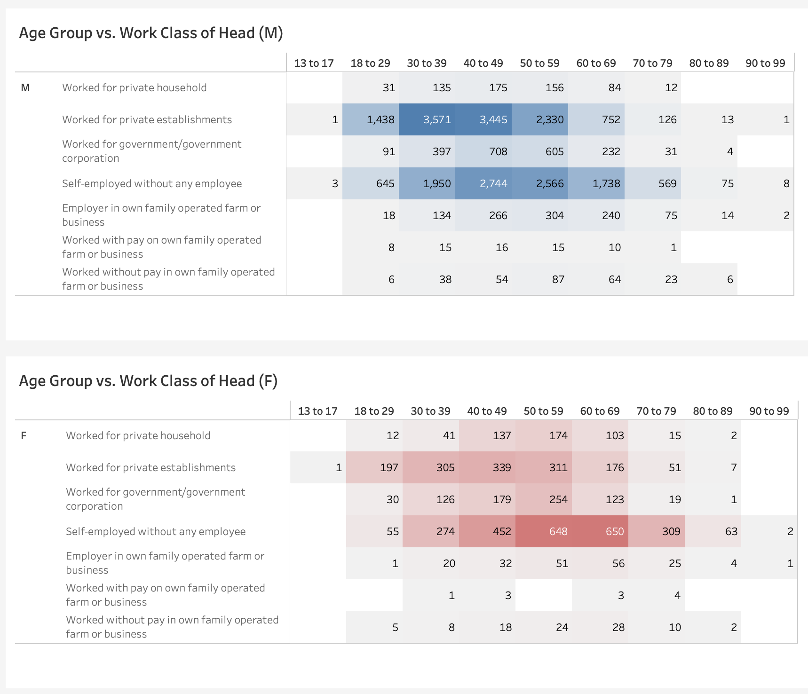
For both sexes, majority worked for private establishments or were self-employed without any employee. It's interesting that female heads aged 50 to 69 are most commonly self-employed without any employee.

```sql
SELECT
    h14_cls_wkr,
    h06_status,
    COUNT(h14_cls_wkr)
FROM
    household_data
WHERE
    h04_sex = 1 AND
    h14_cls_wkr IS NOT NULL
GROUP BY
    h14_cls_wkr,
    h06_status
ORDER BY
    h14_cls_wkr,
    h06_status;
```
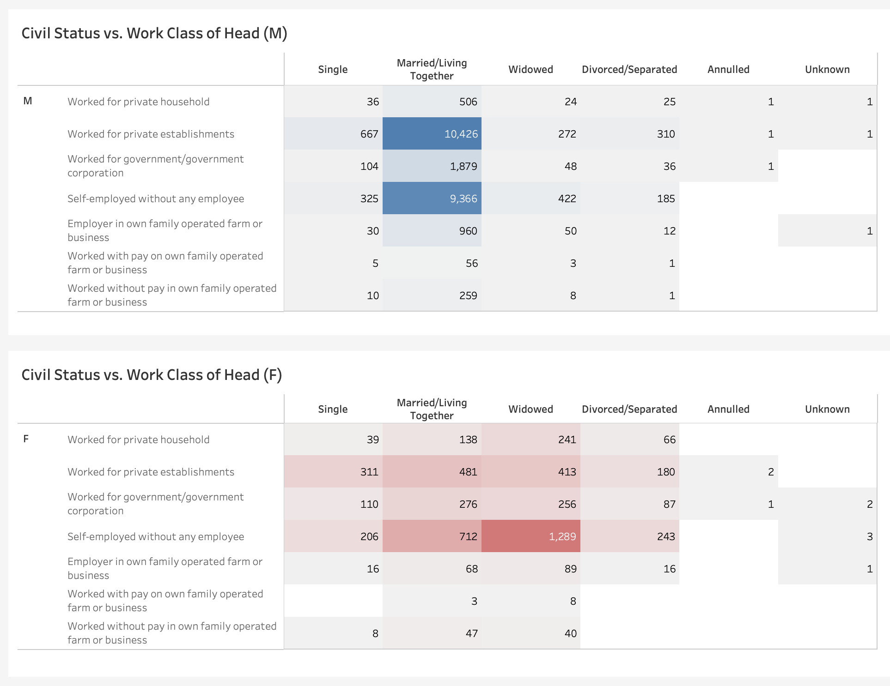
As we saw previously, most heads worked for private establishments or were self-employed without any employee. For males, they are mostly married/living together. For female heads, most that are self-employed are widowed.

## 3. Highest Grade Completed by Head

I wanted to find out if the highest grade completed by the head affected their employment status and work class.
Because there are multiple levels of highest grades completed, the CTA I created was quite lengthy. I won't embed the code here, but you can check out the full code [in this link](analysis/3_head_hgc.sql).

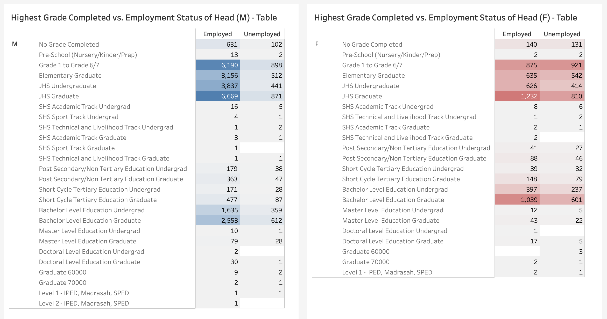
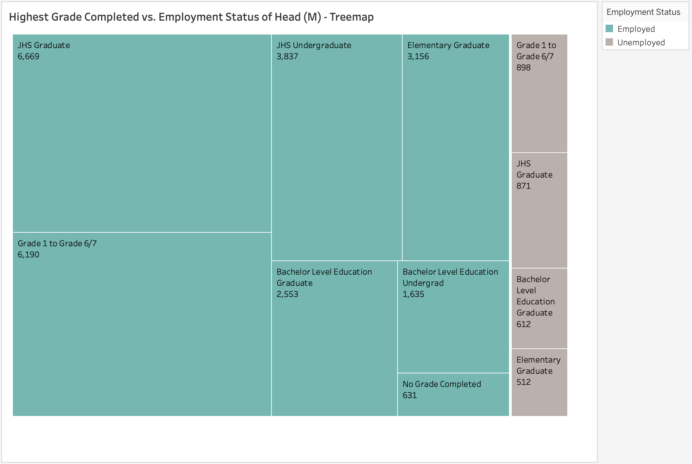
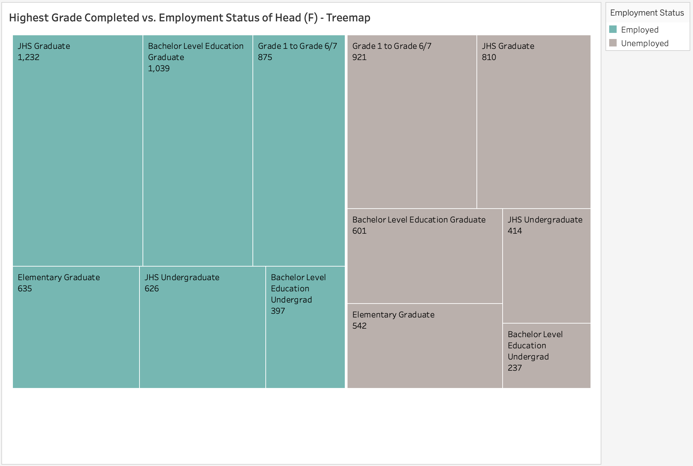
I made use of treemaps to clearly visualize employed heads (green) vs. unemployed (grey). As we can see, the distribution of male heads leans more heavily towards employed, as compared to female heads where it's more evenly spread.

Most employed male heads were Junior High Graduates or Undergraduates, or completed Grades 1 to 6/7. Employed female heads were also commonly Junior High Graduates, but 1,039 of them actually completed Bachelor Level Education.

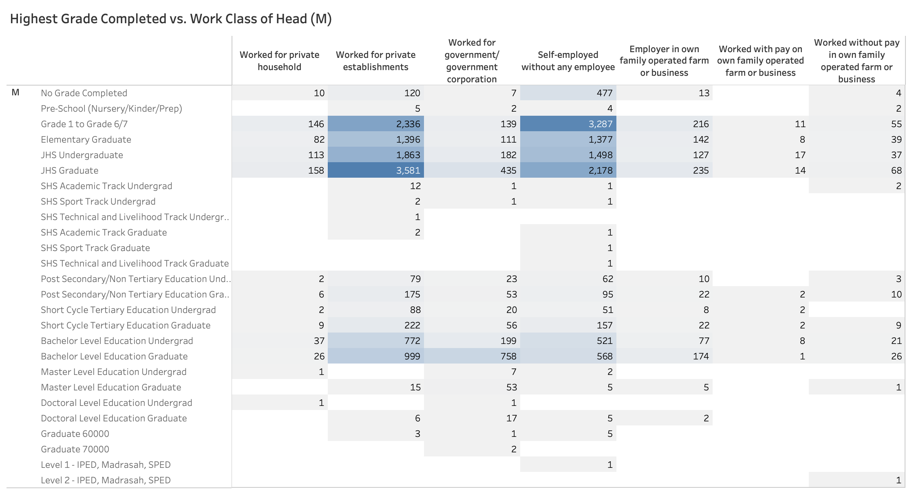
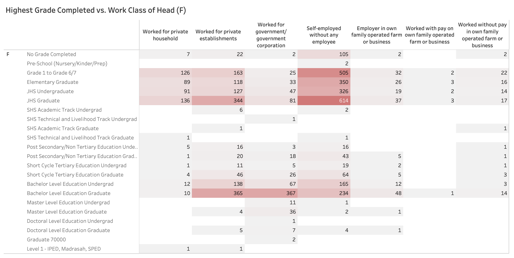
Earlier, we saw that most employed male heads completed JHS or Grades 1 to 6/7. The table shows us that majority of them also work for private establishments or are self-employed without any employee.

For employed female heads, those that were JHS Graduates were mostly self-employed without any employee, but the Bachelor Level Education Graduates most commonly worked for government.

## 4. Schooling Status of Household Member
Now I wanted to take a deeper look at all household members not currently attending school. Their reason for not attending school could be related to their highest grade completed. Again, the CTA I created was lengthy so you can check out the full code [here](analysis/4_hhmember_school.sql).

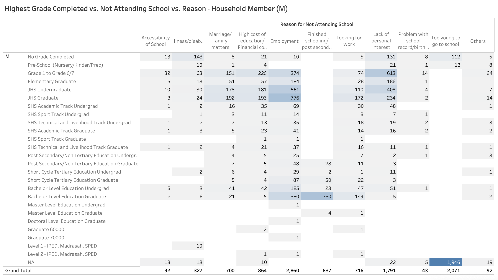
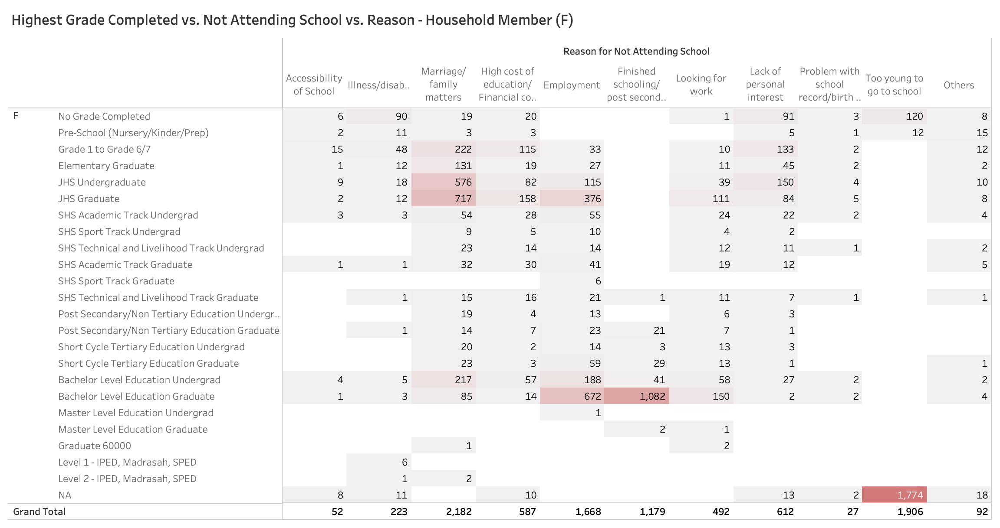
Clearly, those who are too young to go to school have not completed any grade yet. I wanted to focus more on the top reasons of each sex for not attending school, so I visualized this in a bubbles graph:

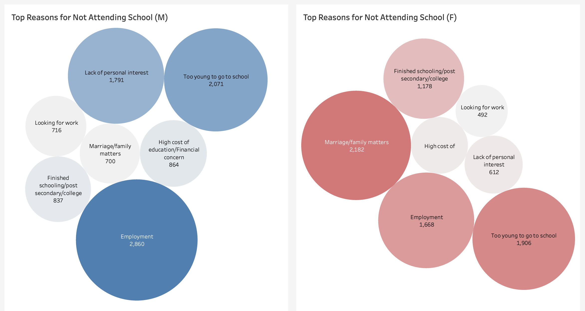
I figured out that a large amount of females mentioned marriage/family matters as their reason for not attending school, while for males it was employment.

This made me wonder, for each sex's top 5 reasons for not attending school, what was the members' relationship to the family head?
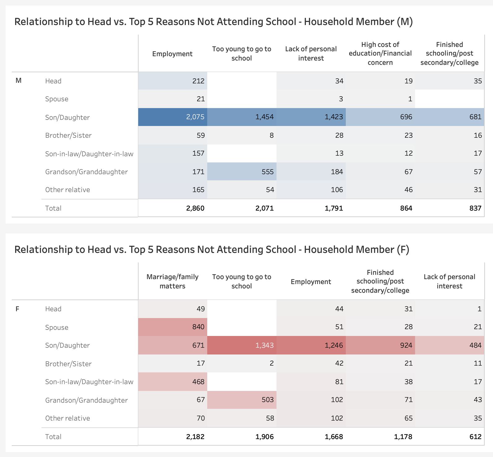
Most of the male household members not attending school were sons of the family head. They were most likely employed, too young, or not interested. Meanwhile, for the females that mentioned marriage/family matters as their reason, they were the spouse of the family head, or daughter/daughter-in-law.

## 5. Financial Status of Household Member
Lastly, I wanted to look at the financial account of household members, and if having an account related to having a job/work.
```sql
SELECT
    c20_bank_acct,
    c03_rem,
    c14_did_work,
    COUNT(c20_bank_acct)
FROM
    person_data
WHERE
    c04_sex = 2
GROUP BY
    c20_bank_acct,
    c03_rem,
    c14_did_work
ORDER BY
    c20_bank_acct,
    c03_rem,
    c14_did_work;
```
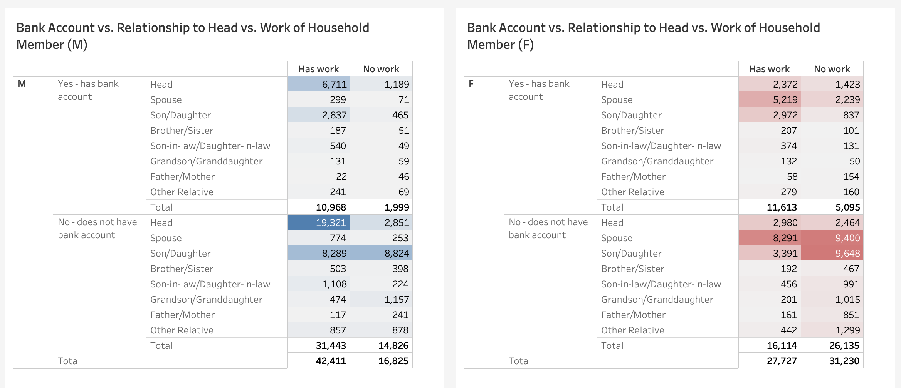
Despite majority of male members having work, a large number of them do not own a bank account. For females, most that own a bank account are the spouse or daughter of the head. However, this is still outnumbered by those who do not have a bank account. I wanted to know more about why most do not own a bank account, but unfortunately this study is limited by the data available, and there was no data on reasons for not owning one.

# 💡 Valuable Takeaways
- 💼 Female heads that were **married/living with partner** were 62.21% employed and 37.79% unemployed, while those that were **widowed** were 49.67% employed and 50.33% unemployed.
- 📘 The top 3 highest grades completed by **employed male heads** were JHS Graduate, Grade 1 to 6//7, and JHS Undergraduate.
- 📕The top 3 highest grades completed by **employed female heads** were JHS Graduate, Bachelor Level Education Graduate, and Grade 1 to 6/7.
- 🖌️ The top 5 reasons of male household members for not attending school were:
    1. Employment
    2. Too young to go to school
    3. Lack of personal interest
    4. High cost of education/financial concern
    5. Finished schooling/post secondary/college.
- Of the 2,860 members that mentioned **employment** as their reason for not attending school, **2,075 are sons of the family head.**
- 🖍️ The top 5 reasons of female household members for not attending school were:
    1. Marriage/family matters
    2. Too young to go to school
    3. Employment
    4. Finished schooling/post secondary/college
    5. Lack of personal interest
- Of the 2,182 members that mentioned **marriage/family matters** as their reason for not attending school, **840 are the spouse of the family head,** 671 are the daughters, and 468 are the daughters-in-law.
- 💰 19,321 male heads (45.56% of all male working household members) stated having **no bank account** or other financial account despite having had work in the past 6 months.

# ✅ Conclusions
The following are the assumptions I have come to about gender roles in the Philippines based on my analysis of the data:
1. **In Filipino culture, men are still heavily influenced or pressured to be the main provider of the household.**
    - 76.5% of all households surveyed were headed by males.
    - 88.61% of male heads were married/living with partner, with 88.01% of them being employed. This means that among married couples, men were usually the working head of the household.
    - 2,860 male household members mentioned employment as their reason for not attending school. This shows a prioritization of working/earning money over finishing school. 
2. **Meanwhile, women are influenced or pressured to be the homemakers or main caretakers of the family.**
    - Only 23.5% of all households surveyed were headed by females. 42.08% of them were unemployed.
    - 30.01% of female heads were married/living with partner while 50.9% were widowed. This shows that households with married couples are usually headed by men, while women only become the head upon the passing of their spouse.
    - 2,182 female household members mentioned marriage/family matters as their reason for not attending school. 840 of them were spouses of the family head, and 1,139 were daughters or daughters-in-law of the family head. This shows that marriage or family took precedence over education.
3. **Both men and women should be given the opportunity to be more financially literate.**
    - 53.52% of male heads and 45.85% of female heads did not own a bank account or other type of financial account.
    - Out of 86,532 male household members surveyed, only 10,968 of those who had work also owned a bank/financial account. 31,443 of those who had work did not own a bank/financial account.
    - Out of 84,521 female household members surveyed, only 11,613 of those who had work also owned a bank/financial account. 16,114 of those who had work did not own a bank/financial account.
    - This shows a gap in financial literacy which could be caused by many factors, such as lack of proper access to such literacy, inadequacy of compensation leading to living paycheck to paycheck, and more.

### 📝 Closing Thoughts
Working on this project made me realize that the Philippines still has a long way to go when it comes to gender equality. Both men and women are victims of societal pressures which lead to inequalities in family, education, and employment. It is also evident that they lack opportunities to become more aware of these gaps and take steps to closing them.

However, the data used for this project was from 2019 (which was 5 years ago), so hopefully things have started to improve since then. I hope the most recent data will become publicly available soon so further studies can be done on the progress of the country, particularly in gender equality. ⚖️